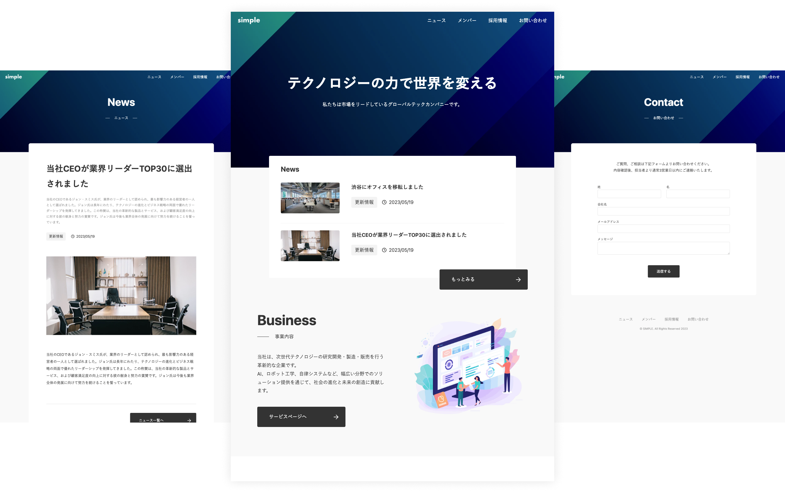

# 株式会社 walk-on のコーポレートサイト

## ページ構成

### トップページ

- カバー写真
- 私たちについてのリンク＋カバー写真
- お知らせへのリンク＋カバー写真
- 事業内容へのリンク＋カバー写真
- 会社概要へのリンク＋カバー写真

### 私たちについてページ（/about）

- Mission
- Vision
- Value

### お知らせページ（/news）

- お知らせ一覧を表示（ページングあり）
- お知らせ詳細ページを作成
- API を作成
  | フィールド ID | 表示名 | 型 |
  | --- | --- | --- |
  | title | タイトル | テキストフィールド |
  | description | 概要 | テキストフィールド |
  | content | 内容 | リッチエディタ |
  | category | カテゴリー | セレクトフィールド（お知らせ、プレスリリース、メディア掲載） |
  | thumbnail | サムネイル画像 | 画像 |

### 事業内容ページ（/service）

- HairWorks の求人広告
- HairWorksAgent の人材紹介
- API を作成
  | フィールド ID | 表示名 | 型 |
  | --- | --- | --- |
  | name | サービス名 | テキストフィールド |
  | head | 概要 | テキストエリア |
  | body | 詳細 | テキストエリア |
  | image | イメージ | 画像 |
  | link | リンク先 URL | テキストフィールド |

### 会社情報（/company）

- 会社情報（住所、代表者）
- 代表からのメッセージ

### 採用情報（/recruit）

- 職種ごとの求人一覧を表示する
  - 会社紹介スライドを埋め込み
    （microCMS のメディア or ソース上に埋め込み）
- 求人詳細ページを作成
- API を作成
  | フィールド ID | 表示名 | 型 |
  | --- | --- | --- |
  | title | タイトル | テキストフィールド |
  | thumbnail | サムネイル画像 | 画像 |
  | catch_copy | キャッチコピー | テキストエリア |
  | recommend_point | おすすめポイント | テキストエリア |
  | place | 勤務先 | テキストエリア |
  | access | 最寄り駅 | テキストエリア |
  | smoking | 受動喫煙防止措置 | テキストフィールド |
  | job_description | 仕事内容 | テキストエリア |
  | education | 教育・研修 | テキストエリア |
  | ideal_profile | 求める人物像 | テキストエリア |
  | work_time | 勤務時間 | テキストエリア |
  | holiday | 休日・休暇 | テキストエリア |
  | salary | 給与 | テキストエリア |
  | welfare | 福利厚生 | テキストエリア |
  | raise_payment | 昇給・賞与 | テキストエリア |
  | entry_process | 応募方法 | テキストエリア |

### お問い合わせ（/contact）

- 問い合わせ先の電話番号、住所、メールアドレスを記載
- 個人情報保護方針ページも作成
- 問い合わせフォーム作成
  - 名前
  - メールアドレス
  - 電話番号
  - お問い合わせ内容



microCMS 公式のシンプルなコーポレートサイトのテンプレートです。
サイト内のお問い合わせ送信先として CRM である [HubSpot](https://www.hubspot.jp/) を利用しています。

## 動作環境

Node.js 18 以上

## 環境変数の設定

ルート直下に`.env`ファイルを作成し、下記の情報を入力してください。

```
MICROCMS_API_KEY=xxxxxxxxxx
MICROCMS_SERVICE_DOMAIN=xxxxxxxxxx
BASE_URL=xxxxxxxxxx
HUBSPOT_PORTAL_ID=xxxxxxxx
HUBSPOT_FORM_ID=xxxxxxxx-xxxx-xxxx-xxxx-xxxxxxxxxxxx
```

`MICROCMS_API_KEY`  
microCMS 管理画面の「サービス設定 > API キー」から確認することができます。

`MICROCMS_SERVICE_DOMAIN`  
microCMS 管理画面の URL（https://xxxxxxxx.microcms.io）の xxxxxxxx の部分です。

`BASE_URL`
デプロイ先の URL です。プロトコルから記載してください。

例）  
開発環境 → http://localhost:3000  
本番環境 → https://xxxxxxxx.vercel.app/ など

`HUBSPOT_PORTAL_ID`
HubSpot のアカウント ID

`HUBSPOT_FORM_ID`
HubSpot のフォームに割り当てられる ID

## 開発の仕方

1. パッケージのインストール

```bash
npm install
```

2. 開発環境の起動

```bash
npm run dev
```

3. 開発環境へのアクセス  
   [http://localhost:3000](http://localhost:3000)にアクセス

## 解説ドキュメント

- [コンテンツ管理](https://github.com/microcmsio/nextjs-simple-corporate-site-template/blob/main/docs/content-management.md)
- [画面プレビューの設定](https://github.com/microcmsio/nextjs-simple-corporate-site-template/blob/main/docs/content-preview.md)
- [ディレクトリ構成](https://github.com/microcmsio/nextjs-simple-corporate-site-template/blob/main/docs/directory-structure.md)
- [HubSpot の準備](https://github.com/microcmsio/nextjs-simple-corporate-site-template/blob/main/docs/hubspot-setting.md)
- [Vercel へのデプロイ](https://github.com/microcmsio/nextjs-simple-corporate-site-template/blob/main/docs/vercel-deploy.md)
